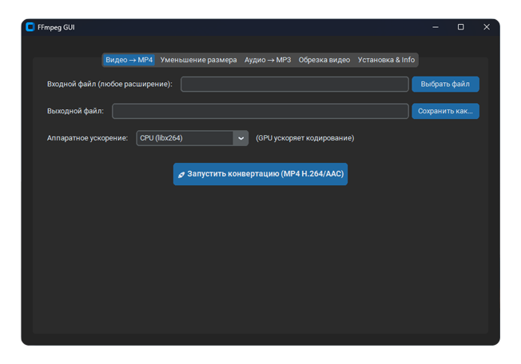

> [!NOTE]
> **FFmpegGUI** – набор команд, призванных ускорить выполнение рутинных задач **конвертации, сжатия и обрезки видео/аудио** с помощью FFmpeg, используя современный графический интерфейс (GUI).
## Требования для выполнения скрипта
- Windows 10/11.
- Python 3.x, установлен и доступен в PATH.
- Библиотека CustomTkinter, установлена:  
    `pip install customtkinter`
- FFmpeg, установлен и доступен в PATH (рекомендуется через Scoop):  
    `scoop install ffmpeg` или `winget install -e --id Gyan.FFmpeg`
## Запуск скрипта
- [Скачайте скрипт](https://github.com/RDF1337/FFmpegGUI/releases/download/v1.0.0/main.py).
- Запустите скрипт в CMD / PowerShell командой `python main.py`.
- Следуйте инструкциям в GUI.  

## Функции скрипта

1. **🎥 Видео > MP4.**
    
    Конвертирует видео из **любого формата** (`.mkv`, `.avi`, `.mov` и т.д.) в универсальный формат **MP4** (кодеки H.264/AAC) для лучшей совместимости.
    
    - Использует `c:v libx264 -crf 23` для высокого качества и совместимости.
    - **Альтернатива:** Позволяет выбрать аппаратное ускорение **NVIDIA (NVENC)** или **AMD (AMF)** для ускоренного кодирования.
2. 📉 **Уменьшение размера видео.**
    
    Сжимает видео **MP4** с высоким качеством до минимального размера, подходящего, например, для отправки через мессенджеры (Telegram).
    
    - Использует `c:v libx264 -crf 28` (более сильное сжатие) и сниженный битрейт аудио (`b:a 64k`).
    - **Альтернатива:** Позволяет выбрать аппаратное ускорение **NVIDIA (NVENC)** или **AMD (AMF)** для ускоренного сжатия.
3. **🎧 Аудио > MP3.**
    
    Конвертирует аудио из **любого формата** (`.ogg`, `.flac`, `.wav` и т.д.) в высококачественный **MP3** (битрейт 320 kbps).
    
    - Использует опцию `vn` для удаления видеопотока (если он есть).
    - Использует кодек `c:a libmp3lame -b:a 320k` для оптимального качества MP3.
4. **✂️ Обрезка видео по таймкодам.**
    
    Позволяет быстро обрезать видео по указанным временам **Начала** и **Конца** (в формате `HH:MM:SS.ms`).
    
    - Использует опцию `c copy`, которая копирует видео- и аудиопотоки без перекодирования.
    - **Особенность:** Это обеспечивает максимальную скорость и отсутствие потери качества, но **не использует аппаратное ускорение**.
5. **⚙️ Дополнительно (Аппаратное ускорение).**
    
    Во вкладках конвертации и сжатия можно выбрать использование ресурсов видеокарты для ускорения рендеринга:
    
    - **NVIDIA (NVENC):** Использует флаги `hwaccel cuda` и кодек `c:v h264_nvenc`.
    - **AMD (AMF):** Использует флаги `hwaccel qsv` и кодек `c:v h264_amf`.
    - **CPU (libx264):** Стандартное, универсальное кодирование с помощью процессора.
